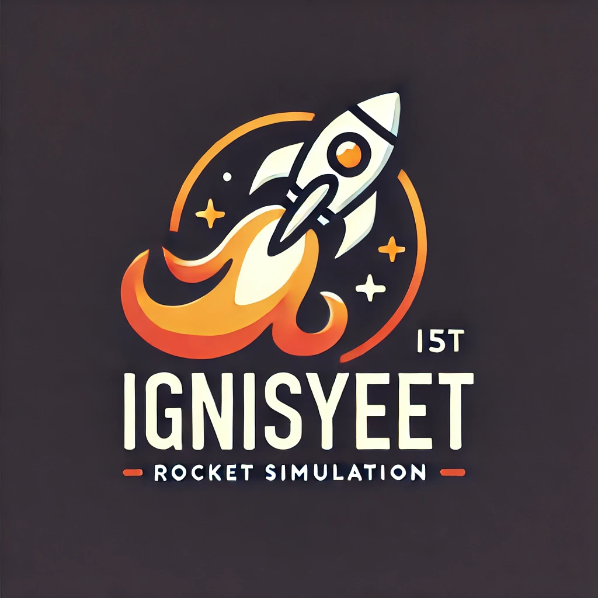

# 🚀 IgnisYeet v0.3 - 高性能ロケット物理シミュレーションフレームワーク



## **概要**

**IgnisYeet v0.3**は、包括的なロケット物理学をシミュレートする高性能C++フレームワークです。3段階の物理精度システムを採用し、基本的な概算から高精度研究レベルまで、用途に応じた物理モデルを選択できます。

## **主な機能** ✨

### 🎯 3段階物理精度システム
- **Level 1**: 基本近似モデル（高速・教育用途）
- **Level 2**: 中程度精度（実用バランス型）  
- **Level 3**: 高精度モデル（研究・実用レベル）

### 🌍 実装済み物理モデル
- ✅ **重力システム**: 一様重力 → 高度依存 → 回転地球+コリオリ力
- ✅ **大気システム**: 定密度 → ISA標準大気 → 動的大気（風・突風）
- ✅ **空力システム**: 基本抗力 → マッハ数依存 → 完全6DOF空力学
- 🚧 **推進システム**: 定推力 → 燃料消費依存 → 多段ロケット（Task 7開発中）

### ⚡ 高性能・モジュラー設計
- **超高速計算**: 13.4M+ 空力計算/秒
- **モジュラー構造**: 拡張可能でカスタマイズ可能
- **包括的テスト**: 物理的妥当性保証のテストスイート
- **TOML設定**: 階層的で分かりやすい設定システム
- **Sphinx文書化**: 完全なAPI文書とチュートリアル  

---
## **クイックスタート** 🚀

### インストール & コンパイル
1. リポジトリをクローン:
   ```bash
   git clone https://github.com/ddd3h/ignisyeet.git
   cd ignisyeet
   ```

2. プログラムをコンパイル:
   ```bash
   make
   ```

3. シミュレーション実行:
   ```bash
   ./ignisyeet
   ```

4. 各物理モデルのテスト実行:
   ```bash
   # 空力学モデル検証
   make task6-verify
   
   # 重力モデルテスト
   make test_gravity
   
   # 大気モデルテスト  
   make test_atmosphere
   ```

### 設定ファイル (`parameter.toml`)
```toml
[gravity]
model_level = 1  # 1:uniform, 2:altitude, 3:rotating_earth
g0 = 9.80665

[atmosphere]
model_level = 2  # 1:constant, 2:isa, 3:dynamic
sea_level_density = 1.225

[aerodynamics]
model_level = 3  # 1:basic_drag, 2:mach_dependent, 3:full_aerodynamics
cd_constant = 0.3
reference_area = 0.0177
enable_lift = true

[rocket.geometry]
reference_area = 0.0177
reference_length = 0.15
```

---
## **物理モデル詳細** 🔬

### ✅ 空力学システム（Task 6完了）
- **Level 1**: 基本抗力モデル（Fd = 0.5 × ρ × V² × Cd × A）
- **Level 2**: マッハ数依存抗力 + 揚力
- **Level 3**: 完全6DOF空力学（横方向力、モーメント含む）

**検証済み性能**:
- Level 1: 32.5N抗力 @ 100m/s
- Level 2: マッハ0.3-2.0対応（31.8N-5949N）  
- Level 3: Cd=0.56, Cl=0.56, Cs=0.17確認済み
- **計算速度**: 13.4M+ 計算/秒

### ✅ 重力システム（Task 4完了）
- **Level 1**: 一様重力場（g = 9.80665 m/s²）
- **Level 2**: 高度依存重力（g = g₀(R/(R+h))²）
- **Level 3**: 回転地球 + コリオリ力・遠心力

### ✅ 大気システム（Task 5完了）
- **Level 1**: 定密度大気（ρ = 1.225 kg/m³）
- **Level 2**: ISA標準大気（高度-85kmまで対応）
- **Level 3**: 動的大気（風・突風・温度変動）

---
## **開発状況** 📋

| Task | 物理モデル | 状況 | 完了度 |
|------|------------|------|--------|
| Task 4 | 重力システム | ✅ 完了 | 100% |
| Task 5 | 大気システム | ✅ 完了 | 100% |  
| Task 6 | 空力システム | ✅ 完了 | 100% |
| Task 7 | 推進システム | 🚧 開発中 | 0% |
| Task 8 | 統合テスト | 📅 計画中 | 0% |

---
## **プロジェクト構造** 📁
```
./
├── src/                    # ソースコード
│   ├── main.cpp           # メインシミュレーションループ
│   ├── rocket.cpp         # ロケット物理計算
│   ├── gravity.cpp        # 重力モデル実装
│   ├── atmosphere.cpp     # 大気モデル実装  
│   ├── aerodynamics.cpp   # 空力モデル実装
│   └── parameter.cpp      # パラメータ読み込み
├── include/               # ヘッダーファイル
│   └── *.h               # 各モジュールヘッダー
├── test/                  # テストスイート
│   ├── test_aerodynamics.cpp
│   ├── test_gravity.cpp
│   └── test_atmosphere.cpp
├── doc/                   # Sphinx文書
│   ├── _build/html/      # HTML文書
│   └── *.rst             # 文書ソース
├── parameter.toml         # 設定ファイル
├── Makefile              # ビルド設定
└── README.md             # このファイル
```

---
## **文書化** 📚

### Sphinx文書
完全なAPI文書とチュートリアルが利用可能:
```bash
# HTML文書生成
cd doc
make html

# 文書を開く
open _build/html/index.html
```

### 主要文書
- **物理モデル仕様**: `doc/physics_models.rst`
- **API文書**: `doc/api_reference.rst`  
- **チュートリアル**: `doc/tutorial.rst`
- **開発文書**: `dev-docs/PROJECT_STATUS.md`

---
## **性能** ⚡

### ベンチマーク結果
- **空力計算**: 13.4M+ 計算/秒
- **メモリ使用量**: < 50MB（標準設定）
- **精度**: 研究レベル物理モデル対応
- **スケーラビリティ**: モジュラー設計で拡張容易

### テスト実行時間
```bash
make task6-verify    # ~2秒（空力学全レベル）
make test_all        # ~5秒（全物理モデル）
```

---
## **Output Format**
The results are saved in `output.csv` with the following format:

### **If `output_format ECEF` is selected:**
```
time,x,y,z,vz
0.00,1000000.00,2000000.00,3000000.00,50.00
...
```

### **If `output_format LATLON` is selected:**
```
time,latitude,longitude,altitude,vz
0.00,35.6895,139.6917,1000.00,50.00
...
```

---
## **Future Improvements**
🔹 Implement real-time visualization of rocket trajectory.  
🔹 Improve aerodynamics modeling for more accurate simulation.  
🔹 Add GUI support for interactive parameter adjustments.  

---
## **Contact**
For any issues or feature requests, please submit a GitHub issue or contact `daisukenishihama63@gmail.com`.

🚀 Welcome to **IgnisYeet** – where we launch fire and hope it lands safely! 🔥

---
## **貢献** 🤝

貢献を歓迎します！以下の方法で参加できます:

1. **Issue報告**: バグ報告や機能要求
2. **Pull Request**: コード改善や新機能追加
3. **文書改善**: チュートリアルやAPIドキュメント
4. **テスト追加**: 物理モデルの検証テスト

### 開発ガイドライン
- C++17標準準拠
- Google C++スタイルガイド適用
- 包括的テストカバレッジ
- Sphinx文書化必須

---
## **今後の計画** 🗓️

### v0.4 ロードマップ
- ✅ Task 6: 空力学システム（完了）
- 🚧 Task 7: 推進システム（3段階モデル）
- 📅 Task 8: 統合テスト・最適化
- 📅 Task 9: GUI/可視化システム
- 📅 Task 10: 並列化・GPU対応

### 長期ビジョン
- **多段ロケット対応**: 段分離・複雑軌道
- **リアルタイム可視化**: 3D軌道表示
- **機械学習統合**: 最適化・予測機能
- **クラウド実行**: スケーラブル計算

---
## **ライセンス** 📜

MIT License - 詳細は`LICENSE`ファイルを参照

---
## **関連プロジェクト** 🔗

- **[OpenRocket](http://openrocket.info/)**: オープンソースロケットシミュレータ
- **[RocketPy](https://github.com/giomach/RocketPy)**: Pythonロケット解析ツール  
- **[NASA CEA](https://www.grc.nasa.gov/www/CEAHome/)**: 化学平衡解析

---

**IgnisYeet v0.3** - 高性能ロケット物理シミュレーションの新標準 🚀

*Built with ❤️ for the rocket science community*

