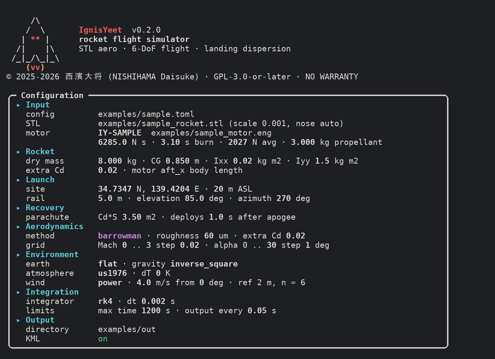
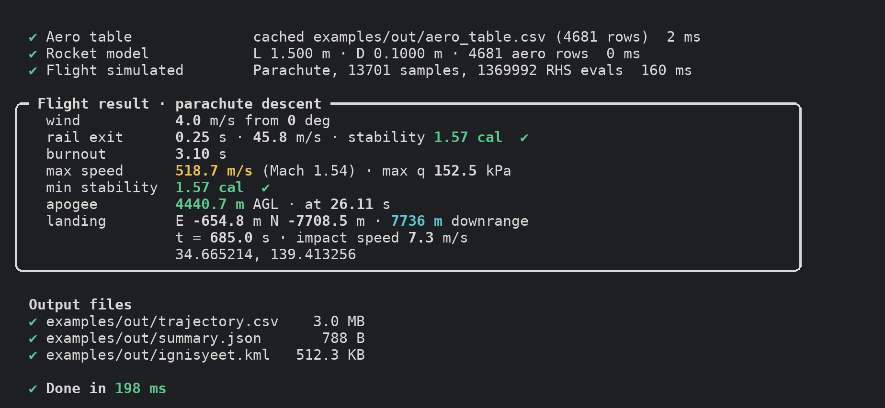
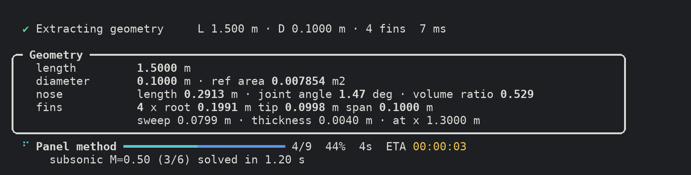
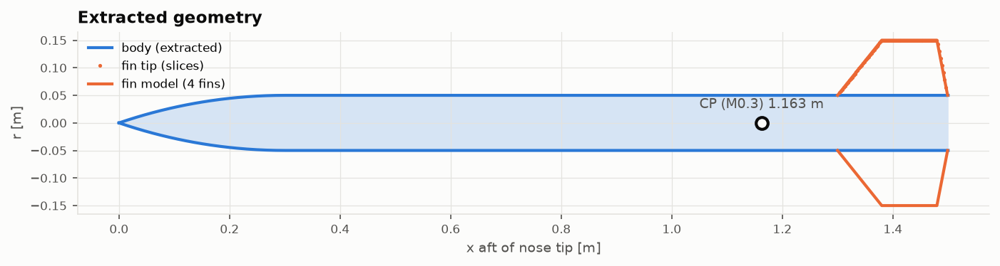
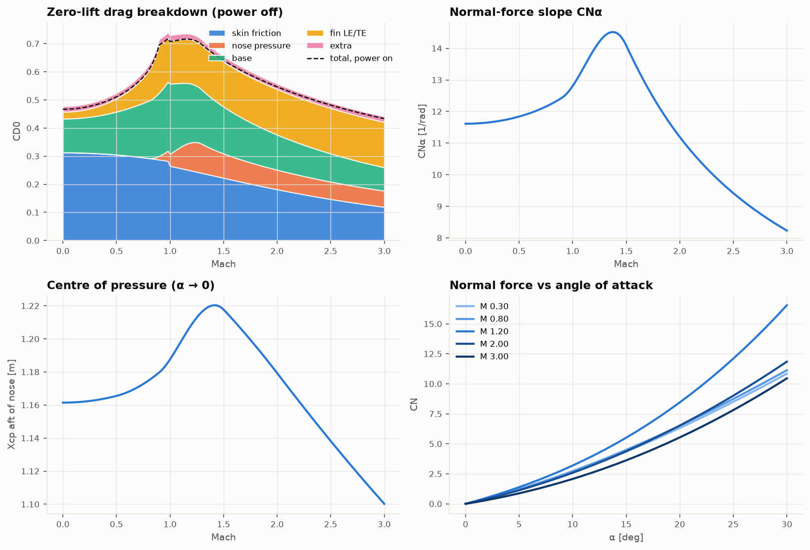
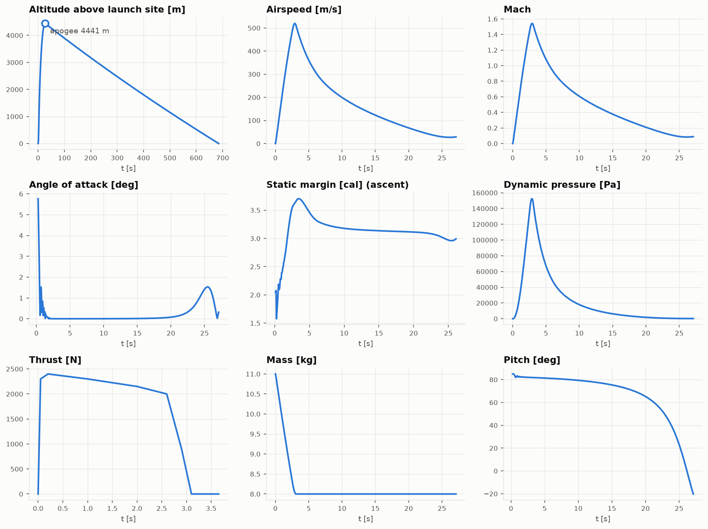
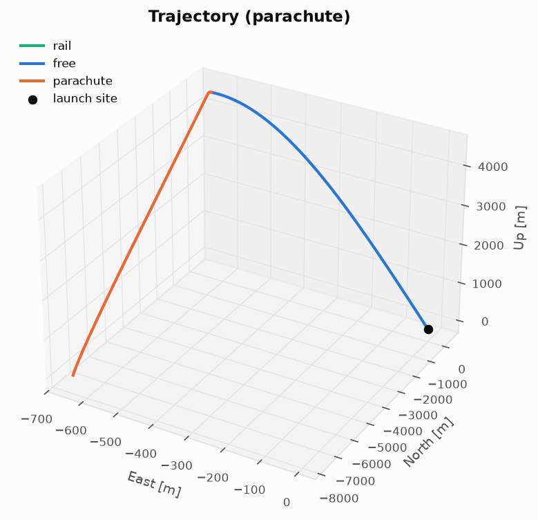
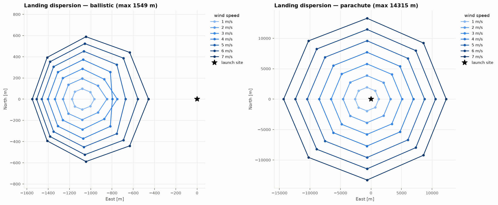
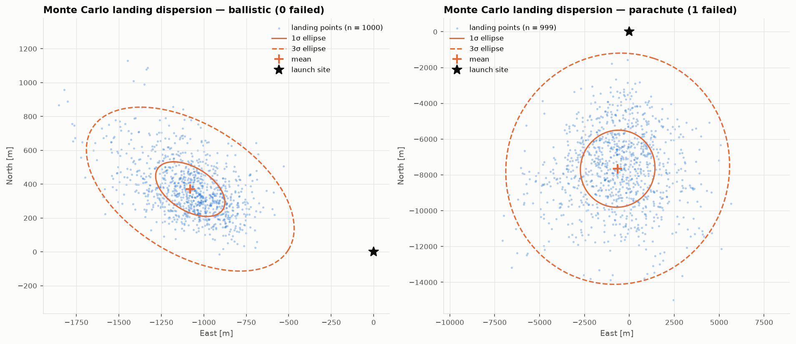
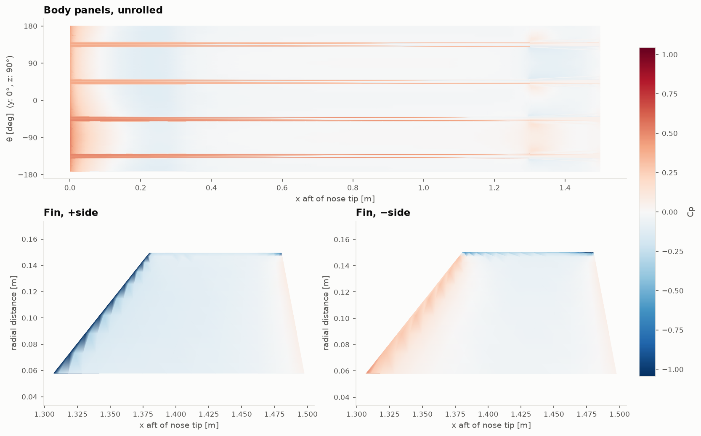

<div align="center">


# IgnisYeet

**A rocket simulator that estimates aerodynamics from an STL file, flies the rocket in 6 degrees of freedom, and computes the landing dispersion**

[](https://github.com/ddd3h/ignisyeet/actions/workflows/docs.yml)
[](https://www.ddd3h.com/ignisyeet/)
[](LICENSE)
[](CITATION.cff)

[](https://www.rust-lang.org/)
[](https://www.python.org/)
[](https://docs.astral.sh/uv/)
[](https://www.sphinx-doc.org/)
[](#requirements)
[](#output-files)
[](CITATION.cff)
</div>

Given a rocket **STL file**, mass properties, a motor thrust curve, and launch-site conditions, IgnisYeet runs the following pipeline:

1. Extracts the body radius distribution and the fin dimensions from the STL
2. Computes the aerodynamic coefficients once on a grid of Mach number and angle of attack, and stores them as a coefficient table
3. Flies the rocket in **6 degrees of freedom**, interpolating and extrapolating the coefficient table
4. Computes the **spread of landing points** with a grid of wind speeds and directions, or with Monte Carlo sampling
5. Plots the results and writes a KML file that can be viewed in Google Earth

The computationally heavy parts (mesh slicing, the aerodynamic coefficient table, the 6-DoF integration, and the parallel landing dispersion) are written in Rust. Plotting is written in Python (matplotlib).

日本語のドキュメント（式・図・検証）は [`doc/`](doc/) にあります。使い方は [`doc/source/usage.rst`](doc/source/usage.rst)、HTML/PDF のビルド方法は [Documentation](#documentation) を参照してください。
Detailed documentation with equations, figures, and verification is available in Japanese in [`doc/`](doc/). See [`doc/source/usage.rst`](doc/source/usage.rst) for usage and [`doc/source/overview.rst`](doc/source/overview.rst) for the computation flow. How to build the HTML and PDF versions is described in [Documentation](#documentation).

## Features

- **Geometry extraction from STL**: principal-axis detection, per-section radius distribution, and automatic estimation of the number and dimensions of fins (manual override is possible)
- **Three aerodynamic models**: Barrowman method (including Niskanen's supersonic and drag extensions), panel method (Morino method for subsonic, local-inclination method for supersonic), and external coefficient tables (e.g. from CFD)
- **Cached coefficient table**: not recomputed if the inputs are unchanged; interpolated inside the range and linearly extrapolated or clamped outside it
- **6-DoF flight**: flat Earth (local ENU) and rotating Earth (ECEF, with Coriolis and centrifugal forces); constant, inverse-square, and J2 gravity
- **Atmosphere and wind models**: US Standard Atmosphere 1976 (with optional temperature offset) and a constant atmosphere; constant, power-law, logarithmic, and altitude-table winds
- **Integrators**: fixed-step RK4 and adaptive-step RK45 (Dormand-Prince)
- **Landing dispersion**: a wind grid (speed x direction) and Monte Carlo sampling (1-sigma and 3-sigma error ellipses), computed in parallel and evaluated for both ballistic descent and parachute descent
- **KML output**: launch site, flight path, and landing-point distributions overlaid in Google Earth
- **Readable terminal output**: configuration summary, progress bars with ETA, and result panels in color (plain output is selected automatically when piped)
- **Sphinx documentation**: Japanese documentation (HTML and PDF)

## Screenshots

### Terminal output

At startup, the contents of the configuration file are shown grouped by item, so you can check units and wind directions before the run.



When the flight computation finishes, a result panel and the list of output files are shown. The static margin carries a verdict mark (green at 1.5 cal or more, `UNSTABLE` below 1.0 cal).



Heavy computations show a progress bar, an ETA, and intermediate results.




### Result figures

All of the following are results for the bundled sample rocket (100 mm diameter, 1.5 m long, four fins), drawn by `python/plot.py`.

**Geometry extracted from the STL** (body outline, detected fins, center of pressure)



**Aerodynamic coefficients** (breakdown of zero-lift drag, slope of the normal-force coefficient, center of pressure, normal force versus angle of attack)



**Flight time history** (altitude, speed, Mach number, angle of attack, static margin, dynamic pressure, thrust, mass, pitch angle)



**3-D flight path** (rail, free flight, and parachute descent are color-coded)



**Landing dispersion on a wind grid** (landing points for each wind speed x direction; ballistic descent on the left, parachute descent on the right)



**Landing dispersion by Monte Carlo** (1000 samples, 1-sigma and 3-sigma error ellipses, RK45; 1000 points of ballistic descent on the left, 999 points of parachute descent on the right)



**Surface pressure coefficient Cp from the panel method** (angle of attack 4 degrees, lowest subsonic Mach number; developed body surface and both sides of the fins)



## Requirements

| Software | Purpose |
|---|---|
| Rust (stable) and `cargo` | Building the main program |
| [uv](https://docs.astral.sh/uv/) and Python 3.10 or later (`venv` and `pip` also work instead of uv) | Plotting (numpy, pandas, matplotlib) |
| LuaLaTeX (luatexja), dvisvgm | Only for building the TikZ figures of the documentation |
| upLaTeX, dvipdfmx, latexmk, inkscape | Only for building the PDF version of the documentation |

## Installation

One-line installer (Linux x86_64 / aarch64, macOS Intel / Apple Silicon):

```sh
curl -fsSL https://raw.githubusercontent.com/ddd3h/ignisyeet/main/install.sh | bash
```

The installer asks whether you are a **user** or a **developer**, shows which tools it already found (cargo, uv, python3, git, conda/micromamba, an existing `ignisyeet-cfd` environment, SU2, gmsh, TeX, ...), and installs only what is missing. Nothing is reinstalled when it is already present, and re-running it is safe.

| Role | What is installed |
|---|---|
| user | The release binary for your platform (sha256 verified) in `~/.local/bin`, the examples and `python/plot.py` in `~/.local/share/ignisyeet/<version>` (with a `current` link), a plotting environment (uv, or `venv` + pip), and an `ignisyeet-plot` command. No documentation tools. |
| developer | A git clone (default `~/ignisyeet`, or the clone you run it from), Rust via rustup if `cargo` is missing, uv, `cargo build --release`, `cargo test --release`, the `python/` and `doc/` environments. Missing documentation tools (TeX Live, dvisvgm, mutool, inkscape, IPAex fonts) are listed with the exact `apt` / `brew` command; the installer never runs `sudo`. |

Both roles can additionally install the CFD tools (SU2, gmsh, Open MPI from conda-forge, about 3 GB) into a conda environment named `ignisyeet-cfd`. An existing micromamba/mamba/conda and an existing environment are reused. On x86_64 Linux CPUs without AVX-512, SU2 is pinned to 8.3.0 because the 8.5.0 package crashes there. The installer prints the `[aero.cfd] prefix` value to put in your configuration (or `IGNISYEET_CFD_PREFIX`).

Options are given after `bash -s --`:

```sh
curl -fsSL https://raw.githubusercontent.com/ddd3h/ignisyeet/main/install.sh | bash -s -- --developer --cfd -y
```

| Option | Meaning |
|---|---|
| `--user` / `--developer` | Choose the role without asking |
| `--cfd` / `--no-cfd` | Install or skip the optional CFD tools |
| `--version vX.Y.Z` | Release to install (default: the latest GitHub release); developer: tag to check out |
| `--prefix DIR` | Install prefix (default `~/.local`) |
| `--dir DIR` | Developer clone location |
| `--no-test` | Developer: skip `cargo test` |
| `--add-path` | Append the `PATH` line to your shell rc file (never done silently) |
| `--force` | Reinstall even if the same version is installed |
| `-y`, `--yes` | No questions; defaults (user, no CFD, no rc-file edit) |
| `--dry-run` | Show the plan and exit |
| `--uninstall` | Remove the binary, links and release data; asks before removing the plotting environment and the CFD environment (`--purge` removes both). A developer clone is deleted only after an explicit confirmation |
| `--no-color`, `--help` | Plain output; usage |

Every option also has an environment variable (`IGNISYEET_VERSION`, `IGNISYEET_PREFIX`, `IGNISYEET_ROLE`, `IGNISYEET_DIR`, `IGNISYEET_CFD=1|0`, `IGNISYEET_YES=1`, ...). Output follows `NO_COLOR`, falls back to ASCII on a non-UTF-8 locale and to plain lines when it is not a terminal. Everything is logged to `~/.local/share/ignisyeet/install.log`.

Releases are published on GitHub as `ignisyeet-<version>-<target>.tar.gz` with a `.sha256` file; the installer verifies the checksum before installing, and you can check it by hand with `sha256sum -c ignisyeet-<version>-<target>.tar.gz.sha256`. To read the script before running it, download it first: `curl -fsSLO https://raw.githubusercontent.com/ddd3h/ignisyeet/main/install.sh && bash install.sh`.

A release is made by pushing a tag equal to the workspace version (`git tag v0.2.0 && git push origin v0.2.0`); the `release` workflow builds the four platform archives and creates the GitHub Release.

### Building from source

```sh
git clone https://github.com/ddd3h/ignisyeet.git
cd ignisyeet
cargo build --release          # produces target/release/ignisyeet
```

### Quick start

Run the whole pipeline (aerodynamics, flight, dispersion, plotting) on the bundled sample rocket.

```sh
make all                        # uses examples/sample.toml
make all CONFIG=my/rocket.toml  # to use your own configuration file
```

`make all` is equivalent to running the following commands in order.

```sh
./target/release/ignisyeet geom       examples/sample.toml   # geometry.json, profile.csv
./target/release/ignisyeet aero       examples/sample.toml   # aero_table.csv/.json, aero_drag.csv
./target/release/ignisyeet sim        examples/sample.toml   # trajectory.csv, summary.json
./target/release/ignisyeet sim        examples/sample.toml --descent ballistic
./target/release/ignisyeet dispersion examples/sample.toml   # dispersion.csv
uv run --project python python/plot.py all examples/out      # plots/*.png
```

To plot with `pip` instead of uv, create a virtual environment first.

```sh
python3 -m venv .venv && . .venv/bin/activate
pip install -r python/requirements.txt
python python/plot.py all examples/out
# via make: make plot PLOT="python python/plot.py"
```

`sim` and `dispersion` run `aero` automatically when there is no coefficient table, or when the STL or the aerodynamic settings have changed. After updating the program itself, rebuild the table with `aero --force`.

## Commands

```text
ignisyeet [-q|--quiet] [--no-progress] <command> ...
```

| Command | Description |
|---|---|
| `geom <config>` | Extracts the geometry from the STL and writes `geometry.json` and `profile.csv` |
| `aero <config> [--force]` | Builds the aerodynamic coefficient table. If the inputs are the same as last time, the stored table is used; `--force` always rebuilds it |
| `sim <config> [--descent ballistic\|parachute]` | Flies once with the configured wind and writes `trajectory.csv` and `summary.json` |
| `dispersion <config>` | Computes the landing dispersion in parallel according to `dispersion.mode` |
| `sample-stl <path>` | Writes the STL of the bundled sample rocket (tangent ogive, four trapezoidal fins, in mm, nose pointing +z) |

| Global option | Description |
|---|---|
| `-q`, `--quiet` | Prints only errors and the paths of the written files (for scripts) |
| `--no-progress` | Does not draw progress bars and spinners (the boxed summaries are still shown) |

`--version` prints the version together with the copyright and license notice.

When stdout is redirected to a pipe or a file, the output is plain line-based text without colors or boxes. The environment variable `NO_COLOR` disables colors, and `TERM=dumb` disables colors and Unicode symbols.

```sh
./target/release/ignisyeet sim examples/sample.toml -q            # only the written paths
./target/release/ignisyeet dispersion examples/sample.toml --no-progress
NO_COLOR=1 ./target/release/ignisyeet aero examples/sample.toml
```

## Configuration file (TOML)

Configuration is written in TOML. Relative paths are resolved against **the directory of the configuration file**. Lengths are in meters, and positions on the rocket are measured from the nose tip toward the tail. The quickest way to start is to copy [`examples/sample.toml`](examples/sample.toml), which lists every item with comments, and edit it. The default value and meaning of each item are summarized in [`doc/source/usage.rst`](doc/source/usage.rst) (in Japanese).

| Section | Main contents |
|---|---|
| `[output]` | Output directory `dir`, `kml` switch for the Google Earth file |
| `[rocket]` | STL path and unit `stl_scale`, `nose_direction`, dry mass, center of gravity, moments of inertia, roughness, fin leading- and trailing-edge shapes, `extra_cd`, `[rocket.fin_override]` (manual fin specification) |
| `[motor]` | RASP `.eng` file, motor aft position `aft_x`, nozzle exit diameter, override of the propellant mass |
| `[launch]` | Latitude, longitude, elevation, rail length, elevation angle, azimuth |
| `[recovery]` | Whether a parachute is used (`enabled`), `cd_s`, deployment delay `delay` |
| `[aero]` | `method` (`barrowman`, `panel`, `table`), external table `table`, Mach and angle-of-attack grids, number of sections `n_slices`, `fin_threshold`, `extrapolation` (`linear`, `clamp`) |
| `[aero.panel]` | Panel-method mesh divisions (`body_axial`, `body_circ`, `fin_chord`, `fin_span`), `wake_length`, `tail_radii`, `subsonic_machs`, `transonic`, `fin_section` |
| `[earth]` | `model` (`flat`, `ecef`), `gravity` (`constant`, `inverse_square`, `j2`; `j2` requires `ecef`) |
| `[atmosphere]` | `model` (`us1976`, `constant`), `temperature_offset`, constant-atmosphere `density`, `sound_speed`, `viscosity` |
| `[wind]` | `model` (`constant`, `power`, `log`, `profile`), wind speed, wind direction (the direction the wind comes from), reference height, power-law exponent, roughness length, altitude table `profile` |
| `[sim]` | `integrator` (`rk4`, `rk45`), `dt`, `rtol`, `atol`, `max_time`, `output_interval`, `descent` |
| `[dispersion]` | `mode` (`wind_grid`, `monte_carlo`), `wind_speeds`, `directions` |
| `[dispersion.monte_carlo]` | `samples`, `seed`, and 1-sigma values for thrust, burn time, dry mass, center of gravity, CN, CA, elevation, azimuth, wind, and parachute |

## Output files

The output directory is `output.dir` (`examples/out/` in the sample).

| File | Contents |
|---|---|
| `geometry.json`, `profile.csv` | Extracted geometry |
| `aero_table.csv`, `aero_table.json` | CN, CA (powered and coasting), Xcp, CNalpha, and damping sum for each (Mach, angle of attack); metadata and a hash of the inputs |
| `aero_drag.csv` | Breakdown of zero-lift drag (total only for the panel method), and the Mach dependence of CNalpha and Xcp |
| `panel_cp.csv` | Surface panels and Cp (angle of attack 4 degrees) when `method = "panel"` |
| `trajectory.csv`, `summary.json` | Time history and main results of a single flight |
| `dispersion.csv` | Landing points of all wind-grid cases (ballistic and parachute descent) |
| `dispersion_mc.csv`, `dispersion_summary.json` | Perturbations and landing point of each Monte Carlo sample, and for each descent mode the mean, covariance, and 1-sigma and 3-sigma error ellipses |
| `ignisyeet.kml` | A single KML file for Google Earth. Folders are `Launch site`, `Flight`, `Dispersion – wind grid`, and `Dispersion – Monte Carlo` (lines only). `sim` and `dispersion` update it while merging each other's results |
| `plots/*.png` | Figures drawn by `python/plot.py` |

## Plotting

```sh
uv run --project python python/plot.py all <out_dir>
uv run --project python python/plot.py {geometry,aero,panel,trajectory,dispersion} <out_dir>
uv run --project python python/plot.py aero <out_dir> --compare <another output directory>
```

| Subcommand | Output |
|---|---|
| `geometry` | `geometry.png` |
| `aero` | `aero.png`. With `--compare`, also draws `aero_compare.png`, which overlays CNalpha, Xcp, and CD0 of two coefficient tables |
| `panel` | `panel.png` (when `panel_cp.csv` exists) |
| `trajectory` | `trajectory.png`, `trajectory_3d.png` |
| `dispersion` | `dispersion.png` if `dispersion.csv` exists; `dispersion_mc.png` if `dispersion_mc.csv` and `dispersion_summary.json` exist |
| `all` | All of the above (those whose input files exist) |

## Documentation

Japanese documentation with equations, figures, and verification can be built from `doc/` (Sphinx).

```sh
cd doc && make html     # doc/build/html/index.html
cd doc && make pdf      # doc/build/latex/ignisyeet.pdf
```

The HTML version needs uv, lualatex (luatexja), and dvisvgm. The PDF version additionally needs uplatex, dvipdfmx, latexmk, and inkscape. Without uv, install the dependencies into a virtual environment and run with an empty `PY`.

```sh
python3 -m venv .venv && . .venv/bin/activate
pip install -r doc/requirements.txt
cd doc && make html PY=     # likewise make pdf PY= for the PDF
```

## Overview of the methods

Detailed equations and derivations are in the chapters of the documentation (in Japanese).

| Stage | Summary | Chapter |
|---|---|---|
| Overall | Processing flow, and why the coefficient table is built first | [`doc/source/overview.rst`](doc/source/overview.rst) |
| Geometry extraction | Principal axis by PCA; radius distribution and fins estimated from sections perpendicular to the axis | [`doc/source/geometry.rst`](doc/source/geometry.rst) |
| Aerodynamics (Barrowman method) | Component build-up of normal force, center of pressure, drag, and pitch damping. Supersonic by Busemann's second-order theory, transonic joined by a cubic | [`doc/source/aerodynamics.rst`](doc/source/aerodynamics.rst) |
| Aerodynamics (panel method) | Morino method (Goethert transformation) for subsonic, local-inclination method for supersonic, cubic Hermite interpolation between them for transonic | [`doc/source/panel.rst`](doc/source/panel.rst) |
| Flight | 6-DoF rigid body, launch-rail constraint, changes in propellant mass, center of gravity, and inertia | [`doc/source/dynamics.rst`](doc/source/dynamics.rst), [`doc/source/propulsion.rst`](doc/source/propulsion.rst) |
| Coordinates and environment | Flat ENU and ECEF, atmosphere, wind, gravity | [`doc/source/coordinates.rst`](doc/source/coordinates.rst), [`doc/source/environment.rst`](doc/source/environment.rst) |
| Landing dispersion | Wind grid and Monte Carlo method, error ellipses | [`doc/source/dispersion.rst`](doc/source/dispersion.rst) |
| Applicability | Limits of the methods | [`doc/source/limitations.rst`](doc/source/limitations.rst) |

Landing points are output as WGS84 latitude and longitude. For descent, you can choose between a parachute (point mass, with `cd_s` and a deployment delay) and ballistic descent (kept in 6 DoF until landing). In a ballistic descent whose apogee is nearly vertical the rocket tumbles, so the landing point is sensitive to small changes. This is real behavior, not numerical noise.

## Verification

```sh
cargo test --release
```

The main things checked by the tests are as follows (details in [`doc/source/verification.rst`](doc/source/verification.rst) and [`doc/source/panel.rst`](doc/source/panel.rst), in Japanese).

- **Geometry extraction**: fin dimensions of a rotated and scaled sample rocket are recovered within 1 mm
- **Barrowman method**: against a hand calculation for the sample rocket (CNalpha = 11.617, center of pressure 1.1619 m), the values computed from the STL agree with CNalpha = 11.617 and 1.1620 m. For the body alone, CNalpha is within 0.02 of 2. Transonic continuity is also checked
- **Panel method**: comparison with analytical potential flows (sphere, spheroid, CNalpha of a slender body, Helmbold wing) and with the relations for supersonic shock waves, expansion waves, and cones. Refining the mesh changes CNalpha by 0.61 %, and the change of CN between adjacent transonic Mach numbers is at most 4.0 %. Compared with the Barrowman method, the subsonic CNalpha of the panel method is about 27 % larger and the supersonic one (M = 2) is 11 % smaller
- **Flight**: analytical solution for vertical flight in vacuum, response to crosswind, agreement between ECEF and flat Earth, westward drift due to the Coriolis force, agreement between RK45 and RK4 (landing points within 1 m)
- **Environment and coordinates**: literature values of the standard atmosphere, hydrostatic equilibrium, J2 gravity, round-trip conversion between geodetic coordinates and ECEF
- **Monte Carlo**: reproducibility of random numbers, agreement with the nominal flight at zero standard deviation, covariance and error ellipses

## Directory layout

```text
Cargo.toml              Rust workspace
crates/geom/            STL I/O, axis detection, sectioning, fin extraction, sample geometry
crates/aero/            Atmosphere, Barrowman/Niskanen model, coefficient table
crates/panel/           Panel-method aerodynamics (Morino method for subsonic, local inclination for supersonic)
crates/sim/             Motor, 6-DoF flight, geodetic computations
crates/cli/             ignisyeet command and TOML configuration
python/plot.py          Plotting (python/ is a uv project)
examples/               sample.toml, sample_rocket.stl, sample_motor.eng (a fictional motor)
doc/                    Sphinx documentation in Japanese (TikZ and matplotlib figures)
doc/images/readme/      Images of this README
Makefile                Wrapper for cargo and uv
LICENSE                 GNU GPL version 3 (full text)
NOTICE                  Copyright, additional terms under GPLv3 section 7(b), and requests
CITATION.cff            Citation metadata
```

## License

IgnisYeet is free software, licensed under the **GNU General Public License, version 3 or (at your option) any later version** (`GPL-3.0-or-later`). The full text is in [`LICENSE`](LICENSE). It comes with NO WARRANTY.

Copyright (C) 2025-2026 西濱大将 (NISHIHAMA Daisuke)

In addition, the following **additional term under section 7(b) of the GPLv3** applies to this program and to works based on it:

- The author attribution "IgnisYeet by 西濱大将 (NISHIHAMA Daisuke)" and the copyright notice must be preserved in all copies and modified versions. This covers the source files, the documentation, and the Appropriate Legal Notices of the program (the startup banner and the `--version` output).
- Modified versions must be marked as changed (this is also required by section 5(a) of the GPLv3).

The exact wording of the terms is in [`NOTICE`](NOTICE).

## Citation and notification (requests, not conditions)

The following are **polite requests only. They are not conditions of the license** and do not restrict any right granted by the GPL. Not following them does not affect your rights.

- **Citation**: if you use IgnisYeet or its results in publications, reports, or presentations, please cite it. Citation metadata is in [`CITATION.cff`](CITATION.cff); GitHub shows a "Cite this repository" button from it.
- **Notification**: if you use IgnisYeet in a project, a publication, or a derived work, please let the author know by e-mail at `daisukenishihama63@gmail.com` or by opening an issue at <https://github.com/ddd3h/ignisyeet/issues>.

## Contact

For bug reports and feature requests, please open a GitHub issue or write to `daisukenishihama63@gmail.com`.
